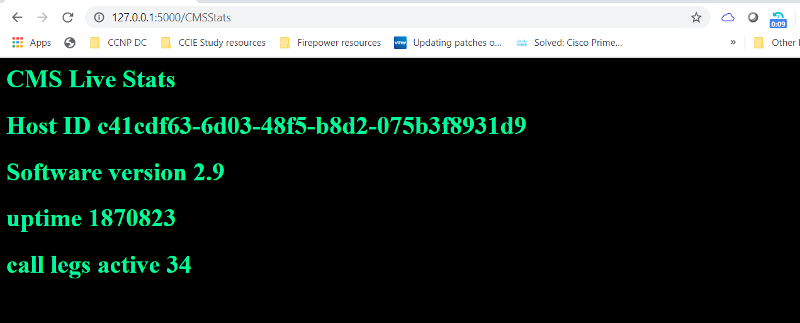
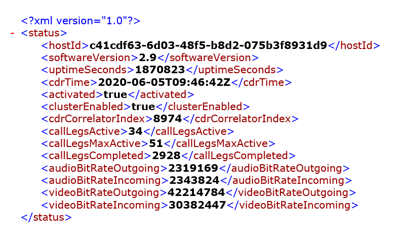
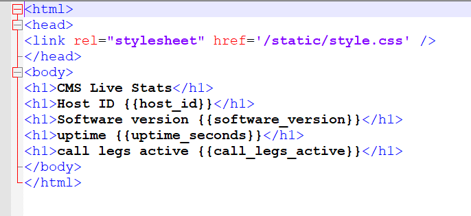

# CMS API status call to web page

reference https://developer.cisco.com/cisco-meeting-server/

Clone this repo
gitclone https://github.com/martinh755/CMS_Server_API_Call.git

This a repository for my CMS API call scripts

There are a number of scripts here to allow an API call to log into Cisco meeting server and poll the API for status.

This url is used to make the API call -url = "https://IP-Address:445/api/v1/system/status". 
You need to update the IP address manually in the file or you could create this as a variable and reference the variable in the url
  
The XML is written to file.

The file is read back in and parsed using element tree to create variables and writes to the stats.py file this is used by the flask template to update the CMSStats html template page in flask by referencing the stats.py variable in the html code

CMSStatus.py does the API call

app.py runs the flask web server and the CMSStats template variables are updated every time the CMSStatus.py uses the scheduler which is currently every minute. THis writes the variables to the stats.py file

For the flask webserver we are accessing the localhost:5000/CMSStats page

Set the file up in a folder running C:\CMSStats or change the file paths in the script to match you directories for these file. if you are running a non windows system for this then remember to change or set the directories as required.

There is nothing in the flask server script to force the client end to refresh the page so you need to add the ajax or javascript to do this. Alternatively add the google automatic refresh plugin.

This is a demo to show how these API stats could be utilised on a webserver.

